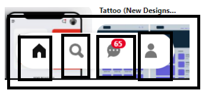

# Parcial
Parcial #2 
Front-and Devepolment
Integrantes:
Heidi Yohana Díaz Álzate
Jhon Steven Penilla
Planeación
Para -> HeaderLayout 
## Escritorio

 
Se creó un div donde esta contiene todos los botones, etiquetas e iconos además acada uno de ellos tiene si etiqueta div. Dentro de otro div están la barra de búsqueda y el icono de la lupa.
## Celular

 
Para la pantalla de celular cada uno de los botones tiene su propio div, aparte de que están en otro div que los contiene, además el botón para ti no está en un div , si no en un spam, pero está en el mismo contenedor con los otros botones.

 
Los iconos están en su respectivo div y tienen un div de contenedor. 
Para -> PinCard

-------------------------------------------

Se creó un contenedor que es tiene la imagen y este a su vez también tienen otro div que contienen los botones de la imagen. Cada botón e icono tienen su propio div. También para el texto.

Para -> PinterestLayout

 
En div se llama los tamaños que va a tomar la imagen.
